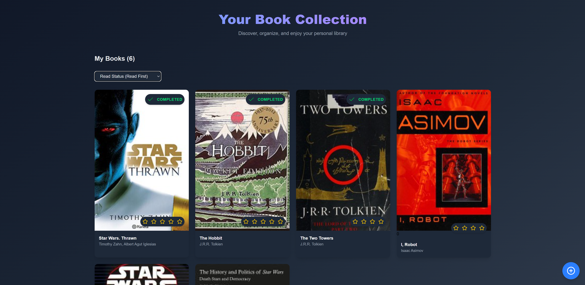

<h1 align="center">📚 Bookble</h1>


## **Description**

Bookble is the ultimate app for book lovers to manage their personal library, discover new reads, and share their literary experiences. With an intuitive interface and powerful features, it allows you to rate books, organize your collection, and interact with fellow readers.

---

## **Screenshots**

Here's a preview of what Bookble looks like:



---

## **Features**

### 🌟 **Core Features**

- **Add Books**: Effortlessly catalog your book collection.
- **Rate Books**: Provide personalized ratings and reviews.
- **Search Books**: Quickly find any book in your library.
- **Filter by Rating**: Sort and filter books based on your preferences.

### 🚀 **Upcoming Features**

- **Wish List**: Keep track of books you're interested in reading.
- **Friends System**: Connect with other book enthusiasts and see their ratings and collections.
- **Custom Book Lists**: Organize your books in custom collections or themes.

---

## **Technologies**

### 🖥️ **Frontend**

- **Vite**: A fast and optimized build tool to enhance development speed.
- **React**: A dynamic, component-based user interface.
- **Tailwind CSS**: Modern, utility-first CSS for a sleek and responsive design.
- **Framer Motion**: Beautiful animations for a smooth and engaging user experience.
- **Lucide-React**: Clean and customizable icons for a polished look.
- **@ericblade/quagga2**: Barcode scanning for easy book addition by scanning ISBN codes.

### 🔧 **Backend**

- **Express**: A fast and minimalist web framework for building APIs.
- **SQLite3**: A lightweight, self-contained database for managing data (soon to be enhanced with an ORM for easier management).
- **JSON Web Token (JWT)**: Secure user authentication and authorization.
- **Bcrypt**: A secure password hashing algorithm for protecting user data.

---

## **Installation**

### 🔽 Clone the Repository

```bash
git clone https://github.com/your-repo/bookble.git
cd bookble
```

### 🖥️ **Frontend Setup**

1. Navigate to the frontend directory:
   ```bash
   cd frontend
   ```
2. Install dependencies:
   ```bash
   npm install
   ```
3. Start the development server:
   ```bash
   npm run dev
   ```

### 🛠️ **Backend Setup**

1. Navigate to the backend directory:
   ```bash
   cd backend
   ```
2. Install dependencies:
   ```bash
   npm install
   ```
3. Start the backend server:
   ```bash
   node index.js
   ```

---

## **Data Sources**

Data is sourced from the following APIs:

- [Google Books API](https://developers.google.com/books)
- [Open Library API](https://openlibrary.org/developers/api)

big thanks to these APIs for providing the data that powers Bookble!

---

## **License**

This project is licensed under the **MIT License** — feel free to use, modify, and distribute as you see fit.
